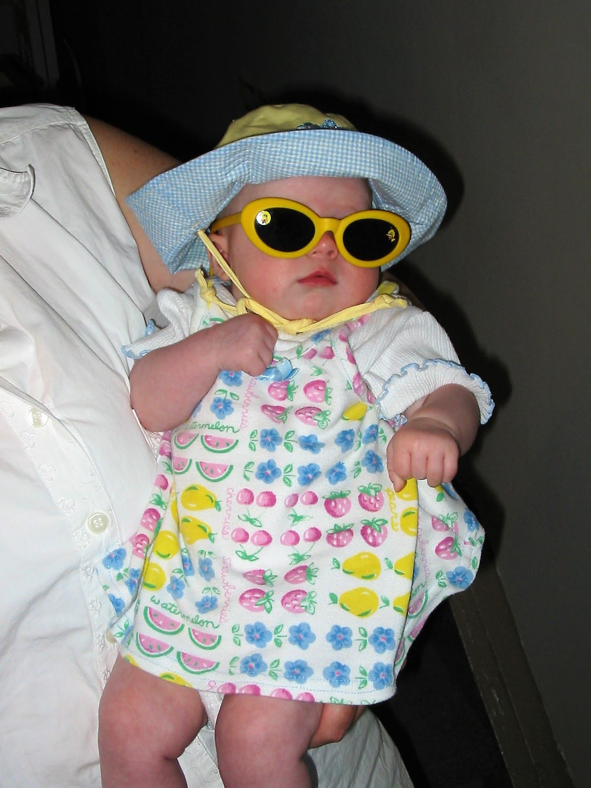

Do I know what to write about? No! But regardless here I am, making my first blog post. Partially out of obligation to the Gatsby JS project I'm working on, partially because I want to get more familiar with Markdown formats, partially cause I think I have a decent personality (while simultainiously thinking I'm hot trash of a human being) and want to share that with the like, 2 friends I have.

But you know what's cool?

## My typing skills are gonna be hekkin amazing after this.

Fun thing about going to college for anything programming related? In the last 8 months I've become great at typing without even looking at the keyboard! I finally have a talent. 

I should try to put a picture up here... How do I do images...

  

_Here's me as a teeny lil thing, givin them my best whip, cloutgoggles 100._

Do I know what else to write now? No! I'm in class at the moment... Should probably be listening cause it's my last class, but I don't know. Things are wrapping up now.

Blogging makes me nervous, haha. It's sort of scary to put a personal blog out there on the internet, full of mean people who don't like the same music as me or are stupid enough to think that I'd be a good target for identity theft.

  

I have a feeling I'm going to be spamming this a little bit whenever I'm bored. Probably will force my family to read this.

Thanks for hanging out.

Stay funky fresh my dudes.